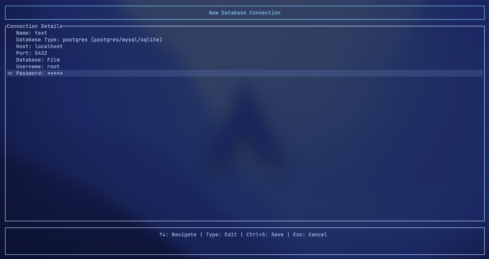
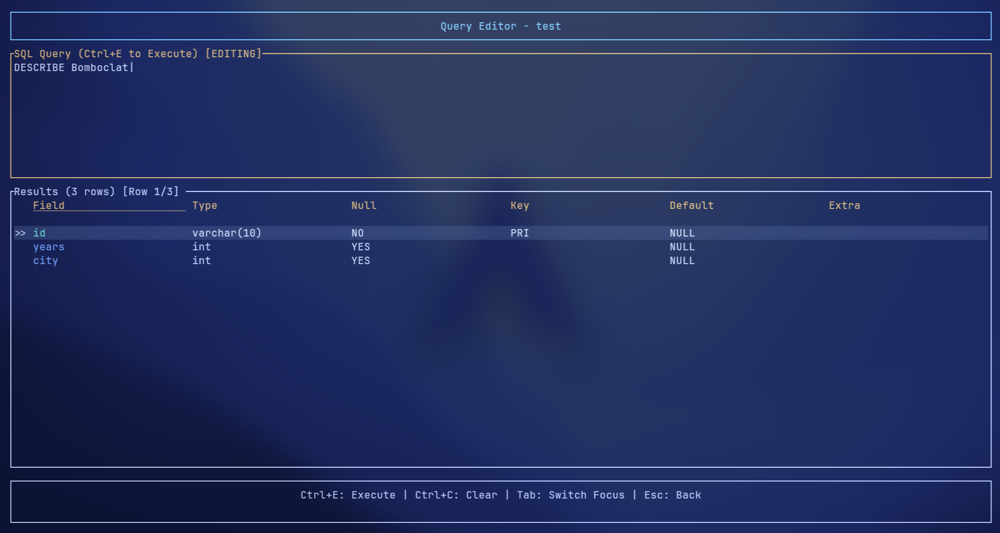

# SQUID
A rust terminal user interface built to interact with databases.

---




---

## Prerequisites
- **Rust** (v1.80 or later) and Cargo
- **Git**
- **Windows or Linux** operating system

---

# Installation

## Windows

### Step 1: Install Rust

1. Download the Rust installer from [https://www.rust-lang.org/tools/install](https://www.rust-lang.org/tools/install)
2. Run the installer and ensure **"Add Rust to PATH"** is enabled
3. Verify the installation by opening PowerShell or Windows Terminal and running:

```powershell
rustc --version
cargo --version
```

### Step 2: Install Git

1. Download Git from [https://git-scm.com/download/win](https://git-scm.com/download/win)
2. During installation, select **"Git from the command line"**
3. Verify the installation:

```powershell
git --version
```

### Step 3: Clone and Build

Open PowerShell or Windows Terminal and run:

```powershell
git clone https://github.com/Lucop1911/squid.git
cd squid
cargo build --release
```

The compiled binary will be at: `target\release\squid.exe`

### Step 4: Install to PATH

Choose one of the following options:

#### Option A: User Installation (Recommended)

```powershell
# Create bin directory if it doesn't exist
mkdir "$env:USERPROFILE\.local\bin" -ErrorAction SilentlyContinue

# Copy the binary
copy target\release\squid.exe "$env:USERPROFILE\.local\bin"
```

Then add `%USERPROFILE%\.local\bin` to your PATH:
1. Press `Win + R`, type `sysdm.cpl`, press Enter
2. Go to **Advanced** → **Environment Variables**
3. Under **User variables**, select **Path** → **Edit**
4. Click **New** and add: `%USERPROFILE%\.local\bin`
5. Click **OK** on all dialogs

#### Option B: System-Wide Installation (Requires Admin)

```powershell
# Run as Administrator
mkdir "C:\Program Files\squid" -ErrorAction SilentlyContinue
copy target\release\squid.exe "C:\Program Files\squid"
```

Add `C:\Program Files\squid` to your system PATH using the same steps as Option A.

### Step 5: Run the Application

Restart your terminal, then run:

```powershell
squid
```

### Updating

To update to the latest version:

```powershell
cd squid
git pull
cargo build --release
```

Then replace the existing executable with the newly built `target\release\squid.exe`.

---

## Linux

### Step 1: Install Prerequisites

Most Linux distributions come with Git pre-installed. To install Rust:

```bash
curl --proto '=https' --tlsv1.2 -sSf https://sh.rustup.rs | sh
```

Follow the on-screen instructions, then reload your shell:

```bash
source "$HOME/.cargo/env"
```

Verify installation:

```bash
rustc --version
cargo --version
git --version
```

### Step 2: Clone and Build

```bash
git clone https://github.com/Lucop1911/squid.git
cd squid
cargo build --release
```

The compiled binary will be at: `target/release/squid`

### Step 3: Install the Binary

Make the binary executable and move it to a directory in your PATH:

#### Option A: User Installation (Recommended)

```bash
# Create bin directory if it doesn't exist
mkdir -p ~/.local/bin

# Make executable and copy
chmod +x target/release/squid
cp target/release/squid~/.local/bin/
```

Ensure `~/.local/bin` is in your PATH by adding this to your `~/.bashrc` or `~/.zshrc`:

```bash
export PATH="$HOME/.local/bin:$PATH"
```

Then reload your shell:

```bash
source ~/.bashrc  # or source ~/.zshrc
```

#### Option B: System-Wide Installation (Requires sudo)

```bash
chmod +x target/release/squid
sudo cp target/release/squid/usr/local/bin/
```

### Step 4: Run the Application

```bash
squid
```

### Updating

To update to the latest version:

```bash
cd squid
git pull
cargo build --release
```

Then replace the existing binary in your installation path:

```bash
# For user installation
cp target/release/squid~/.local/bin/

# For system-wide installation
sudo cp target/release/squid/usr/local/bin/
```

---

## Troubleshooting

### Command not found after installation
- **Windows**: Restart your terminal after adding to PATH
- **Linux**: Run `source ~/.bashrc` or restart your terminal

### Build errors
Ensure you have Rust 1.80 or later:
```bash
rustup update
```

---

## License
This project is licensed under the **Apache License 2.0**.  
See [LICENSE](LICENSE) for details.